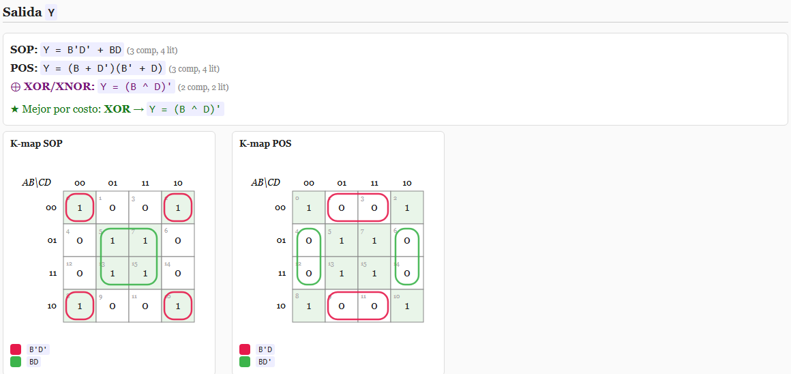

<p align="center">
  <b>English</b> · <a href="LEEME.md">Español</a>
</p>

<div align="center">


# KTool

### Digital logic, minimised exactly — and it tells you when XOR is cheaper.

Fill in a truth table (by hand, from a boolean expression, or from a list of
minterms) and get back the Karnaugh map, the minimal SOP **and** POS equations,
the gate diagram, and an HTML document with all of it.

[](LICENSE)
[](https://www.python.org/)
[](../../actions/workflows/ci.yml)
[](../../releases/latest)


<br>



</div>

---

That picture is a real report, not a mockup — and it shows the thing this tool
does that a K-map by hand doesn't. For that function, SOP costs 3 gates and POS
costs 3 gates, but the function is the parity of B and D, so **`(B ^ D)'` costs
2**. KTool checks that third path every time and tells you when it wins.

## What it is

One tool with **two faces**: a **command-line interface** for when you already
know the minterms and want the answer in the terminal, and a **graphical
interface** that behaves like a spreadsheet for when you're filling a table in by
hand. Both produce the same self-contained HTML document.

It was written for a digital systems course, and it is shaped by that: it handles
several outputs at once, it counts the cost of what it proposes, and it points
out the terms two outputs could share, because that's the part a homework
question actually cares about.

## Purpose and scope

**The purpose.** To be right, and to show its work. Minimising by eye on a
Karnaugh map is where the marks get lost — a group missed, a don't-care wasted,
a POS that would have been cheaper. This does the mechanical part exactly, and
then hands you a document you can read and check.

**What it covers.** Up to **6 variables** and **10 outputs** in one table.
Quine-McCluskey minimisation with don't cares, SOP and POS side by side with
their cost, XOR/XNOR as a third candidate, shared-term detection between outputs,
coloured K-maps, gate diagrams, and export to seven languages.

**What it is not.** A practice project, not a professional design tool. The
arithmetic is exact — truth table plus Quine-McCluskey — but confirm the output
before you build something on it.

## Contents

- [What it is](#what-it-is) · [Purpose and scope](#purpose-and-scope)
- [Install](#install)
- [How to start (CLI)](#how-to-start-cli) · [Expression syntax](#expression-syntax)
- [How to use it (GUI)](#how-to-use-it-gui)
- [What comes out](#what-comes-out) · [Known limitations](#known-limitations)
- [For developers](#contributing)

> **The command is `ktool`.** `kmap` is a historical alias — the project started
> out only drawing Karnaugh maps — and still works identically.

## Install

**A — Windows installer (easiest).** Grab the latest from
[Releases](../../releases/latest) and run it; it puts `ktool` on your `PATH`. Or,
in one line of PowerShell:

```powershell
irm https://raw.githubusercontent.com/leostriker111/KTool/main/get-ktool.ps1 | iex
```

**B — pip**, if you already have Python:

```powershell
pip install git+https://github.com/leostriker111/KTool.git
```

**C — from source:**

```powershell
git clone https://github.com/leostriker111/KTool.git
cd KTool
packaging\install.ps1
```

Without installing anything, from the project folder: `python -m ktool ...`

## How to start (CLI)

```powershell
ktool -e "A'B + C" --open                 # build the table from an expression
ktool -n 3 -m 1,4,5,6 -d 2,7              # minterms and don't cares
ktool -n 4 -m 0x1,0b11,5 --text           # mixed bases, equations in the console
ktool -n 3 --truth 01x011x1 --form both   # output vector straight in
ktool ... --gates-only                    # gates only, no K-map and no table
ktool gui                                 # open the window
ktool -h                                  # full help
```

| switch | what it's for |
|---|---|
| `-n, --vars N` | Number of variables (2 to 6). |
| `-e, --expr "..."` | Boolean expression; builds the table by evaluating every case. |
| `-m, --minterms ...` | Minterms in decimal, `0x` hex or `0b` binary. |
| `-d, --dontcares ...` | Don't cares, same syntax. |
| `--truth 01x10...` | Output vector directly (length `2^n`, `x` allowed). |
| `--name Y` | Name of the output. |
| `--form sop\|pos\|auto\|both` | Which form to show. `auto` picks the cheapest. |
| `--no-kmap` / `--no-circuit` / `--no-table` | Leave a section out. |
| `--gates-only` | Gates only (turns off K-map and table). |
| `--text` | Just print the equations to the terminal. |
| `--out file.html` / `--open` / `--title "..."` | Where the document goes, whether to open it, and its title. |

### Expression syntax

| operation | how you write it |
|---|---|
| AND | `ab`, `a*b`, `a.b`, `a&b` |
| OR | `a+b`, `a\|b` |
| NOT | `a'`, `!a`, `~a` |
| XOR | `a^b` |
| XNOR | `(a^b)'` |

Variables are the letters `A` to `F`. Precedence: NOT, then AND, then XOR, then
OR.

## How to use it (GUI)

```powershell
ktool gui
```

A table in the style of the classic solvers. Along the top you pick the number of
variables and outputs, turn on the notes column, and choose the form (SOP, POS,
auto or both). The expression bar fills a whole column by evaluating whatever you
type. *Ecuaciones* shows the result in the lower panel and *Generar documento*
builds the HTML.

Filling a table in fast is the part that was actually designed:

| action | how |
|---|---|
| Select a range | Drag across cells, or <kbd>Shift</kbd>+click to extend. They highlight in blue. |
| Set the whole selection | <kbd>1</kbd>, <kbd>0</kbd> or <kbd>x</kbd> changes every selected cell at once. |
| Cycle one cell | Double-click: `0 → 1 → x`. |
| Copy in and out | <kbd>Ctrl</kbd>+<kbd>C</kbd>/<kbd>V</kbd>/<kbd>X</kbd>, in a format Excel understands. |
| Rename an output | Click its column header. |

The *Ayuda* menu has the quick guide, the shortcut list, and a link back here.

## What comes out

One self-contained HTML document. Per output: the SOP and POS equations with
their cost, the recommended form, the Karnaugh map with the groups circled in
colour and named in a legend, the circuit, and the truth table.

With more than one output it adds a section listing the terms that appear in
several — the gates you could physically share — and a combined circuit.

The equations also come out as **Verilog, VHDL, ABEL, Logisim, C, Python and
LaTeX**, each with a copy button.

## Known limitations

Worth stating plainly, since the whole point is being trustworthy:

- **XOR/XNOR detection** applies when the complete function is the parity of a
  subset of the variables. It does not factor partial XORs out of a large SOP.
- **The circuit assumes complemented literals are available** (`A'` rails), and
  it does not draw a single schematic with the shared gates merged in — those are
  listed separately.
- **No symbolic boolean algebra** over arbitrary expressions.

<br>

---

<div align="center">

## 🔧 For developers

*Everything above is what it does. Everything below is how it does it.*

</div>

---

### Contributing

The `main` branch is protected, so changes come in by Pull Request. See
[CONTRIBUTING.md](CONTRIBUTING.md).

Where help would go furthest:

- **Partial XOR factoring** — the biggest real limitation above, and the one that
  would most change the quality of the answers.
- **A single combined schematic** with the shared gates actually drawn in, rather
  than listed.
- **More target languages** in `codegen.py` — SystemVerilog and VHDL-2008 are the
  obvious gaps.
- **Verification against a known-good minimiser** (Espresso) over random
  functions, as a test.

The design notes are in [docs/DESIGN.md](docs/DESIGN.md).

### What it's made of

**Python 3.8+ with no external dependencies at all** — standard library only,
Tkinter for the window. That is a deliberate constraint: this gets run on lab
computers where you cannot install anything, and `pip install` would already be
one obstacle too many. It's also why the output is a single HTML file rather than
a rendered PDF.

### The modules

About 2,400 lines, split by job.

<details open>
<summary><b>core — the maths</b></summary>

<br>

| module | lines | what it does |
|---|--:|---|
| `core/lexer.py` | 44 | Turns an expression into tokens. |
| `core/parser.py` | 75 | Tokens into a syntax tree, with the precedence above. |
| `core/ast.py` | 52 | The tree nodes, and evaluating one for a given input. |
| `core/table.py` | 74 | The truth table: minterms, don't cares, several outputs. |
| `core/qm.py` | 108 | **Quine-McCluskey.** Prime implicants and the cover — the exact part. |
| `core/simplify.py` | 151 | Runs the three candidates (SOP, POS, XOR), costs them in gates and literals, and picks. |
| `core/kmap_layout.py` | 46 | Gray-code ordering, so that adjacent cells really are adjacent. |

</details>

<details>
<summary><b>render — the document</b></summary>

<br>

| module | lines | what it does |
|---|--:|---|
| `render/report.py` | 318 | Assembles the HTML: everything inline, no external files. |
| `render/circuit.py` | 374 | Draws the gates. The largest single file, because laying out a schematic is genuinely harder than minimising it. |
| `render/codegen.py` | 170 | The seven output languages. |
| `render/kmap.py` | 112 | The map, with each group circled in its own colour. |

</details>

<details>
<summary><b>gui and cli</b></summary>

<br>

| module | lines | what it does |
|---|--:|---|
| `gui/app.py` | 680 | The window and the spreadsheet-like table. |
| `gui/displays.py` | 89 | Showing the results in the lower panel. |
| `cli.py` | 134 | Argument parsing and the pipeline. |
| `theme.py` | 23 | Colours shared between the window and the report. |

</details>

### The decision behind the interesting part

Most K-map tools give you SOP. Some give you SOP and POS. The reason this one
computes a **third** candidate is that for a whole family of common functions —
parity, comparators, adders — both of the first two are wrong answers to the
question "what is cheapest". A 4-variable parity function is four AND gates and
an OR in SOP, and a single XNOR in reality.

So `simplify.py` doesn't minimise, it **competes**: it builds all three, prices
each in gates and literals, and reports the winner along with the two losers so
you can see the margin. That is also why the cost is printed next to every
equation rather than only next to the chosen one.

### License

[MIT](LICENSE).

### Related projects

- **[Logisim Evolution](https://github.com/logisim-evolution/logisim-evolution)** —
  *use that to simulate the circuit;* KTool exports straight to its format.
- **[Espresso](https://en.wikipedia.org/wiki/Espresso_heuristic_logic_minimizer)** —
  *reach for that beyond 6 variables,* where exact minimisation stops being
  practical and heuristics take over.
